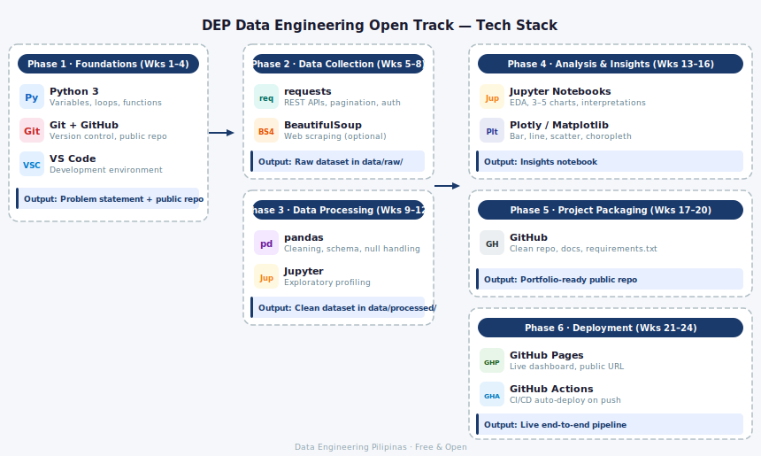

# DEP Data Engineering Open Track: A 6-Month Project-Driven Build Journey

> A 6-month, self-paced, project-driven learning journey. Participants build a real, deployable data project using free and open-source tools.

**Cohort:** June – November 2026 &nbsp;|&nbsp; **Time:** ~5 hrs/week &nbsp;|&nbsp; **Cost:** Free

---

## What You'll Build

By the end of the program, every participant will have:

- A **public GitHub repo** with a clean, documented data project
- A **live deployed dashboard** (GitHub Pages)
- An **end-to-end data pipeline** (ingest → clean → analyze → deploy)

---

## How to Use This Repo

This is the **program hub** — it contains the curriculum, weekly resources, and milestone guides.

**Builders:** Follow the phase folders in order. Each week folder has resources, tasks, and links.

**Volunteers:** See [docs/VOLUNTEER_GUIDE.md](docs/VOLUNTEER_GUIDE.md) for your role and responsibilities.

---

## Curriculum

| Phase | Weeks | Focus | Output |
|-------|-------|-------|--------|
| [01 — Foundations](01-foundations/) | 1–4 | Problem framing, Git, Python basics, APIs | Defined problem statement + first data pull |
| [02 — Data Collection](02-data-collection/) | 5–8 | APIs, web scraping, ingestion | Raw dataset saved locally |
| [03 — Data Processing](03-data-processing/) | 9–12 | Cleaning, structuring with pandas | Clean, schema-defined dataset |
| [04 — Analysis & Insights](04-analysis-and-insights/) | 13–16 | EDA, visualization | Insights notebook with 3–5 charts |
| [05 — Project Packaging](05-project-packaging/) | 17–20 | Repo cleanup, documentation | Professional, shareable repo |
| [06 — Deployment](06-deployment/) | 21–24 | Static dashboard, GitHub Pages | Live, publicly accessible project |

---

## Milestones

Progress is tracked through 7 milestones (M0–M6). Each one has a clear output and a submission form.

| Milestone | When | Output |
|-----------|------|--------|
| M0 — Problem Statement | End of Week 1 | Defined question + public repo |
| M1 — Data Source Identified | End of Week 5 | Dataset chosen and documented |
| M2 — Data Ingestion Script | End of Week 8 | Working `01_ingest.py` |
| M3 — Clean Dataset | End of Week 12 | Working `02_clean.py` + clean data |
| M4 — Initial Insights | End of Week 16 | Notebook with 3–5 charts |
| M5 — Public Repo | End of Week 20 | Clean, presentable GitHub repo |
| M6 — Live Deployment | End of Week 24 | Live dashboard on GitHub Pages |

Full checklist: [docs/MILESTONE_CHECKLIST.md](docs/MILESTONE_CHECKLIST.md)

---

## Getting Started (Participants)

1. **Join the community** — [Discord link here]
2. **Set up your project repo** — use the [DEP Starter Kit](https://github.com/dai-dep/dep-starter-kit) template
3. **Start Phase 1** — go to [01-foundations/](01-foundations/) and begin Week 1

---

## Tech Stack

---

## Cohorts

- [2026 Cohort](cohorts/2026/) — June–November 2026 *(current)*

---

## For Volunteers

See [docs/VOLUNTEER_GUIDE.md](docs/VOLUNTEER_GUIDE.md) for role descriptions, responsibilities, and the operating rhythm.

---

*Built by Data Engineering Pilipinas. Free and open. Always.*
